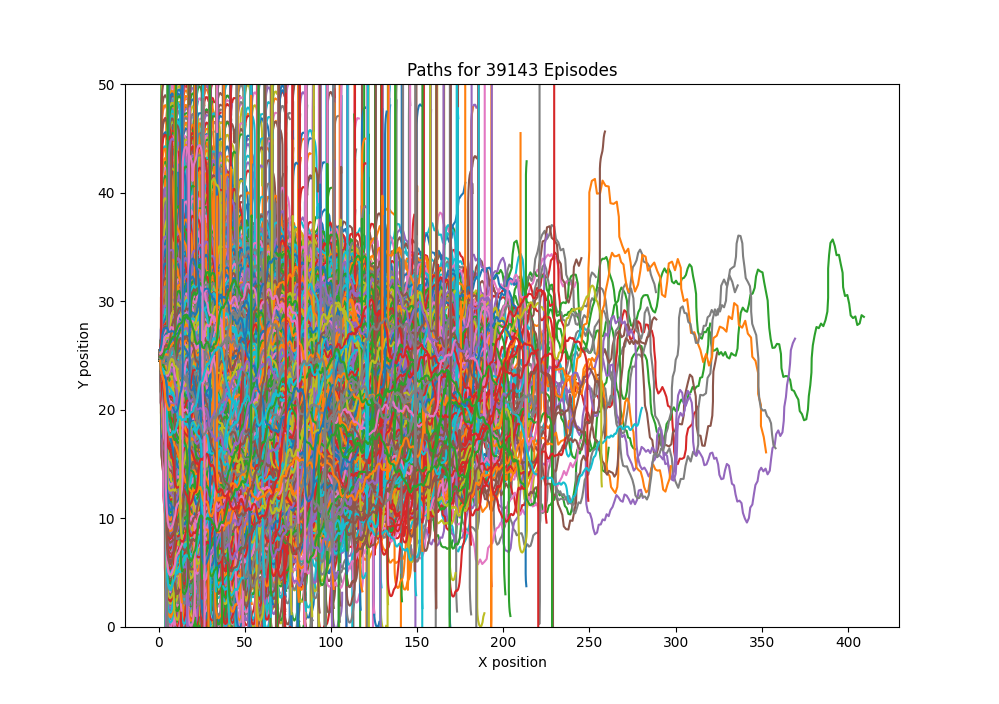

# Autonomous-car-obstacle-avoidance

## Overview

This project makes use of Deep Reinforcement Learning to help a simulated car navigate through a map of obstacles that are randomly generated.
Here, Proximal Policy Optimization (PPO) is used. The steering angle and acceleration are treated as two parameters of an action space. The model rewards forward motion (along the horizontal pathway), and gives a negative reward for collisions or negligible motion.

## Methodology

Used Proximal Policy Optimization (PPO), with learning rate 3e-4, 4096 steps, and batch size 256, run over 2 million time-steps.
Obtained mean reward of 483.03 for the trained model, compared to 55.32 for random policy, over 1000 tested episodes.

## Results

Here are some plots of the paths taken over each episode of training by the model.
The first plot is for the model run with a learning rate of 1e-2, 32 steps, and batch size 64, run over 100K time-steps. Here it is clear that the agent could not really move ahead past the 40 unit mark (in the x-position).

The second set of plots is taken later, after trying out multiple iterations of the model with different sets of hyperparameters. Here, a learning rate of 3e-4 is taken, with 4096 steps, and batch size of 256, run over 2 million time-steps.
This model is able to reach the 400 unit mark in the x-position, which is an approximately 10 fold improvement in forward-motion-performance. I check using two different reward systems, and there is a slight difference in terms of the divergence of the paths in the initial stages of training.

Here is a short clip of running the model during testing, for a few episodes:

## To Run

**Installation of packages**: Run 'pip install -r requirements.txt' inside an environment to install the needed packages.

### Project files
- **objs.py** : this file contains class definitions for Car and Environment. NOT RUNNABLE AS MAIN.
- **CarNavigationGymEnv.py** : defines a custom python gym environment for being used during training.
- **renderer.py** : this file is where the graphics for displaying the window with the car and the obstacle grid are rendered.
- **train.py** : this file is used to train the model, using a custom python gym environment, with a PPO model, and test its performance.
- **displayPlotFromPathData**: this file generates a plot of all the paths taken by the agent during training, over all episodes, to help visualize the effectiveness of the model. It loads the episode paths from the episode_paths.pkl file (which gets saved after train.py has completed execution)._

### Other files
- **simulate.py** : this file contains a simple rendering program that I wrote, initially in mind as the main renderer, but later as a useful testing tool, to see if the agent and environment are working correctly (in the untrained state).
- **train_obsolete.py** : this was previously the train.py file, attempting to use a DQN model, but I was not able to get it to work, and so I abandoned this approach, and went to a simpler, different approach by using the python Gym environment.

## Resources

### Relevant references
- Stable-Baselines3 Docs - Reliable Reinforcement Learning Implementations. https://stable-baselines3.readthedocs.io/en/master/
- Proximal Policy Optimization. https://spinningup.openai.com/en/latest/algorithms/ppo.html
- PPO Algorithm. https://medium.com/@danushidk507/ppo-algorithm-3b33195de14a

### Older references I was using earlier (for a DQN based model)
- Deep Q-Learning/Deep Q-Network (DQN) Explained | Python Pytorch Deep Reinforcement Learning. https://www.youtube.com/watch?v=EUrWGTCGzlA
- https://github.com/johnnycode8/gym_solutions/blob/main/frozen_lake_dql.py
- Reinforcement Learning (DQN) Tutorial. https://pytorch.org/tutorials/intermediate/reinforcement_q_learning.html#:~:text=This%20tutorial%20shows%20how%20to,CartPole%2Dv1%20task%20from%20Gymnasium.&text=The%20agent%20has%20to%20decide,attached%20to%20it%20stays%20upright.
